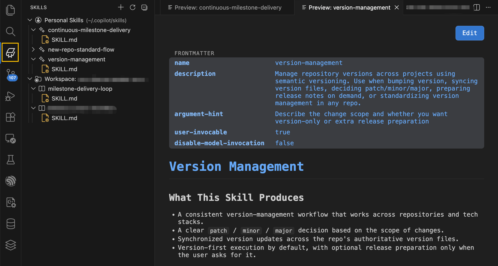

# Skills of LLM

Skills of LLM is a VS Code extension for browsing, previewing, editing, and creating GitHub Copilot skill files.

It is designed around the day-to-day workflow of using `SKILL.md` files, not just storing them in a repository.



## What It Does

- Shows personal and project skills in a dedicated `Skills` sidebar
- Opens skill markdown in a readable preview by default from the skills tree
- Provides a one-click `Edit` action to switch from preview to normal text editing
- Creates new skills with a guided wizard
- Adds syntax highlighting, diagnostics, and snippets for `SKILL.md`
- Optionally creates an Explorer mirror folder (`.!SKILLS`) for native file access

## Main Workflow

### Browse Skills

Open the `Skills` activity bar icon to see:

- `Personal Skills` from `~/.copilot/skills`
- `Workspace` skills from `.github/skills` or `.copilot/skills`

Each skill folder shows its files as a tree. Clicking a markdown file opens the preview directly.

### Preview First, Edit When Needed

The extension is optimized for preview-first reading:

- Clicking a skill markdown file in the `Skills` tree opens preview
- The preview window includes an `Edit` button in the top-right corner
- Hovering files in the `Skills` tree shows an edit action for normal text editing

If you enable the Explorer mirror folder, markdown files under `.!SKILLS` also open in preview by default.

### Create New Skills

Use the `+` button in the `Skills` view, or run `Skill Preview: New Skill`.

The wizard will:

1. Ask whether the skill should be created in personal or workspace scope
2. Ask for the skill folder name
3. Ask for display name and description
4. Generate a ready-to-edit `SKILL.md`

## Features

### Skills Sidebar

- Dedicated Activity Bar entry for skills
- Personal and workspace sources grouped separately
- Auto refresh when files change
- Vendor-aware icons for well-known skill names
- Inline edit action on file items

### Preview Webview

- Renders frontmatter in a readable table
- Renders markdown body as formatted HTML
- Includes an `Edit` button for switching to plain text editing
- Opens in the active editor column instead of split view

### Syntax Highlighting

Files named `SKILL.md` or ending with `.skill.md` get:

- YAML frontmatter highlighting
- Markdown highlighting for the body
- File icons for supported skill markdown files

### Diagnostics

The extension reports common authoring problems:

- Missing frontmatter delimiters
- Missing required `name`
- Missing required `description`
- Unknown frontmatter fields

### Snippets

Available in `SKILL.md` and markdown skill files:

- `skill`
- `skill-min`
- `## when`
- `## produces`
- `## steps`
- `## policy`

## Settings

| Setting | Default | Description |
|---------|---------|-------------|
| `skill-preview.personalSkillsPath` | `""` | Override the personal skills root. Defaults to `~/.copilot/skills`. |
| `skill-preview.extraSkillPaths` | `[]` | Add extra skill roots to scan. |
| `skill-preview.showFileCount` | `true` | Show file count badges on skill folders. |
| `skill-preview.disableExplorerSkillMirrorFolder` | `true` | When enabled, the extension does not create the `.!SKILLS` mirror folder in Explorer. |

## Explorer Mirror Folder

If `skill-preview.disableExplorerSkillMirrorFolder` is set to `false`, the extension creates:

```text
.!SKILLS/
	Local Skills/
	Project Skills/
```

This gives you a native Explorer entry point to skill files while keeping the dedicated `Skills` sidebar available.

## Skill File Format

Typical example:

```markdown
---
name: my-skill
description: 'Short description shown in the skill picker'
argument-hint: 'What context to provide when invoking'
user-invocable: true
disable-model-invocation: false
---

# My Skill

## When To Use

Describe when the skill should be selected.

## What This Skill Produces

- Expected outputs

## Steps

1. Step one
2. Step two
3. Step three
```

## Install

Install the packaged extension from a `.vsix`, or install it from your distribution channel.

## Use Cases

- Review skills without switching into raw markdown immediately
- Maintain personal skills and project-specific skills in one place
- Author new skills with validation and snippets
- Keep workspace skills readable for teammates
